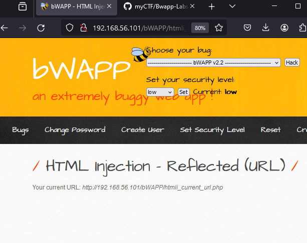

# HTML Injection - Reflected (URL) (LOW)



#### **Process:**
```plaintext
-----------------------------------------------------
1. It seem that our host url is reflecting to the page 
2. We can use burp suite and try to manipulate the url that has been reflected 
3. I have changed the HOST method 
4. It was 192.168.56.101 now its showing 1.1.1.1
```

#### **Burpsuite:**
```plaintext
GET /bWAPP/htmli_current_url.php HTTP/1.1

Host: 1.1.1.1
User-Agent: Mozilla/5.0 (Windows NT 10.0; Win64; x64; rv:126.0) Gecko/20100101 Firefox/126.0
Accept: text/html,application/xhtml+xml,application/xml;q=0.9,image/avif,image/webp,*/*;q=0.8
Accept-Language: en-US,en;q=0.5
Accept-Encoding: gzip, deflate, br
Referer: http://192.168.56.101/bWAPP/portal.php
Connection: keep-alive
Cookie: PHPSESSID=a84cc200c53ee6438048b8ebe8130855; security_level=0
Upgrade-Insecure-Requests: 1
Priority: u=1

```
