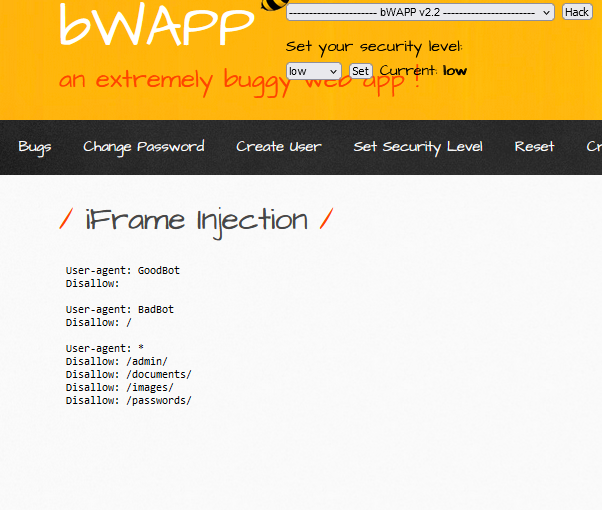

# iFrame Injection


#### **Process:**
```plaintext
-----------------------------------------------------
1. At first check the url endpoint.
2. Or check the html code if there are any vulnerable iframe exists or not.
3. Try to cutomize the iframe tag .

```

#### **Vulnerable URL:**
```plaintext
http://192.168.56.101/bWAPP/iframei.php?ParamUrl=robots.txt&ParamWidth=250&ParamHeight=250
```


#### **Vulnerable HTML code**
```html

   <iframe frameborder="0" src="robots.txt" height="250" width="250"></iframe>

```
```plaintext
Understading the Code:
--------------------------------------------------
1. here src = robot.txt , if we enumerate a little bit we can find robot.txt is a directory of bwapp . 
2. If we just change the direcotry to something else it will be toggled into the webpage's iframe
3. we can add website or directories related to bwapp and it will work same.
```
#### **Process:**
```plaintext
-----------------------------------------------------
4. we all know that login.php is a directory of bwapp
5. we can change the direcotry to something else it will be toggled into the webpage's iframe

```
