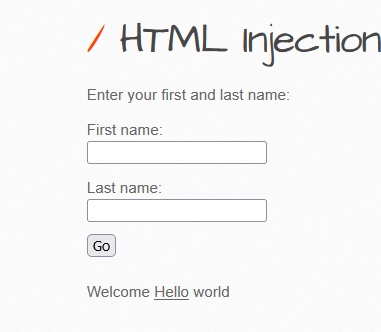

# HTML Injection - Reflected (GET) (LOW)

#### **Process:**
```plaintext 
-----------------------------------------
1. At first check the input boxes that how its 
reflect 
2. If its reflecting and also giving an url endpoint its probably a reflected GET Html injection vulnerability
```
#### **URL Endpoint:**
```plaintext
192.168.56.101/bWAPP/htmli_get.php?firstname=&lastname=world&form=submit
```


#### **Payload:**
```html
<u>Hello</u>

```

