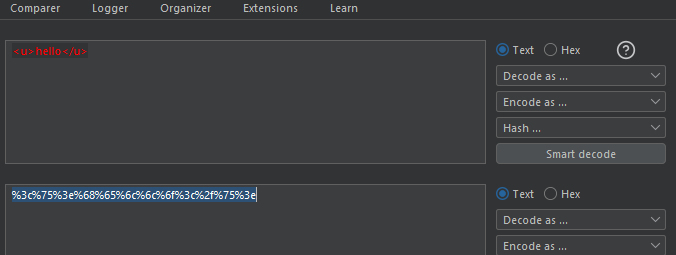
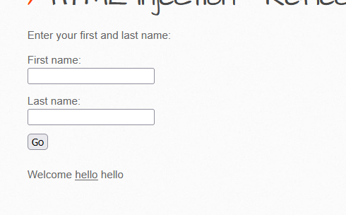

#  HTML Injection - Reflected (POST) (MEDIUM)


#### **Process:**
```plaintext 
-----------------------------------------
1. At first check the input boxes that how its 
reflect 

2. If its reflecting and also giving an url endpoint its probably a reflected GET Html injection vulnerability

3. If its not reflecting the url endpoint then its sure that we have to use 
burp proxy for the endpoints

```
#### **Payload: 1**
```html
<u>Hello</u>

```

#### **Burp Proxy**  

```plaintext

POST /bWAPP/htmli_post.php HTTP/1.1
Host: 192.168.56.101
User-Agent: Mozilla/5.0 (Windows NT 10.0; Win64; x64; rv:126.0) Gecko/20100101 Firefox/126.0
Accept: text/html,application/xhtml+xml,application/xml;q=0.9,image/avif,image/webp,*/*;q=0.8
Accept-Language: en-US,en;q=0.5
Accept-Encoding: gzip, deflate, br
Content-Type: application/x-www-form-urlencoded
Content-Length: 42
Origin: http://192.168.56.101
Connection: keep-alive
Referer: http://192.168.56.101/bWAPP/htmli_post.php
Cookie: PHPSESSID=072b29678df3bc882e8b672204474edc; security_level=0
Upgrade-Insecure-Requests: 1
Priority: u=1

firstname=<u>hello</u>&lastname=world&form=submit
```
#### **Process:**
```plaintext 
-----------------------------------------
4. For the Payload:1 is giving us &lt;u&gt;hello&lt;/u&gt; in return 

5. It means the backend is validating <,>and/ 
6. So here we will use the URL encoder to bypass thae validation

```


#### **Process:**
```plaintext 
-----------------------------------------
4. For the Payload:1 is giving us &lt;u&gt;hello&lt;/u&gt; in return 

5. It means the backend is validating <,>and/ 
6. So here we will use the URL encoder to bypass thae validation

```
#### Encoded



#### **Payload: 2**
```plaintext
%3c%75%3e%68%65%6c%6c%6f%3c%2f%75%3e
```


