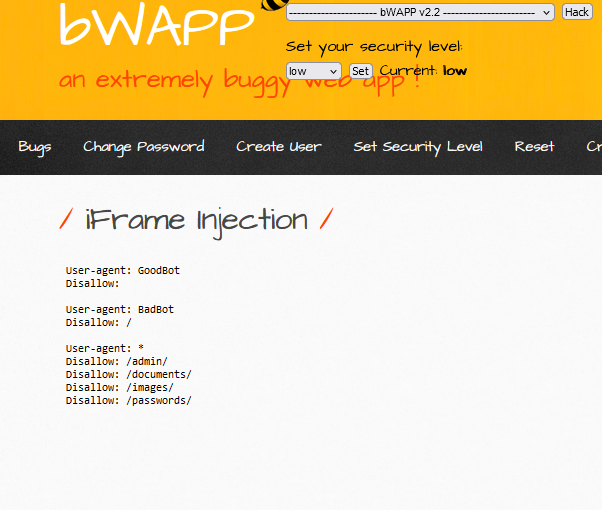
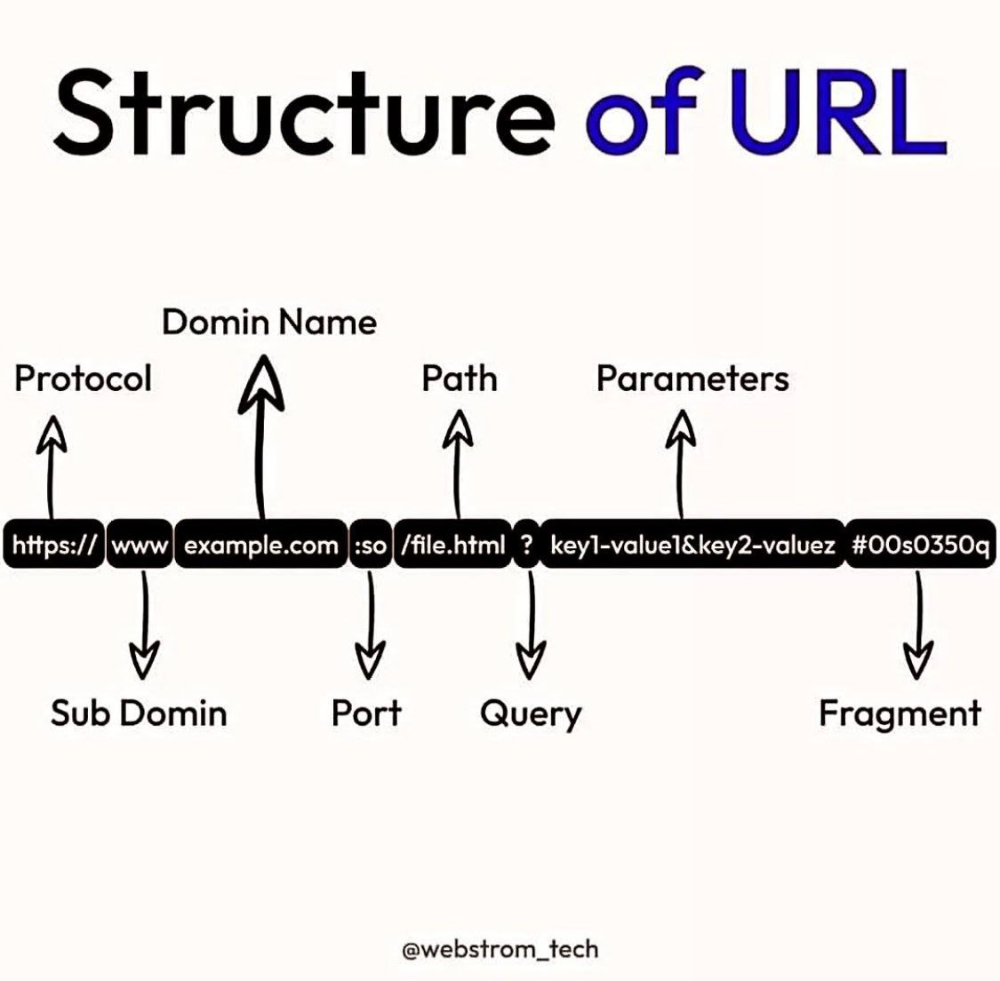

# iFrame Injection


#### **Process:**
```plaintext
-----------------------------------------------------
1. At first check the url endpoint.
2. Or check the html code if there are any vulnerable iframe exists or not.
3. Try to cutomize the iframe tag .

```

#### **Vulnerable URL:**
```plaintext
http://192.168.56.101/bWAPP/iframei.php?ParamUrl=robots.txt&ParamWidth=250&ParamHeight=250
```


#### **Vulnerable HTML code**
```html

   <iframe frameborder="0" src="robots.txt" height="250" width="250"></iframe>

```

#### **Payload:**

```html
></iframe><u>Hello</u>

```
> ##### It will work like the bellow one!

```html
<iframe frameborder="0" src="robots.txt" height="250" width="250"></iframe><u>Hello</u>

```
