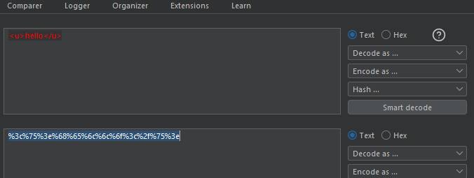
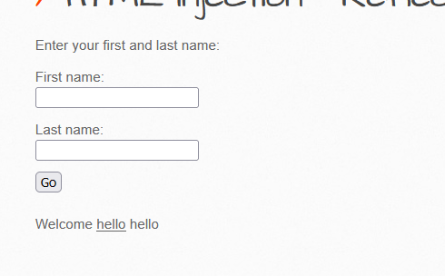

# HTML Injection - Reflected (GET) (Medium)

#### **Process:**
```plaintext 
-----------------------------------------
1. At first check the input boxes that how its 
reflect 

2. If its reflecting and also giving an url endpoint its probably a reflected GET Html injection vulnerability

3. We will use the Burp Proxy here.
```


#### **Payload: 1**
```html
<u>Hello</u>

```

#### **Process:**
```plaintext 
-----------------------------------------
4. For the Payload:1 is giving us &lt;u&gt;hello&lt;/u&gt; in return 

5. It means the backend is validating <,>and/ 
6. So here we will use the URL encoder to bypass thae validation

```
#### Encoded



#### **Payload: 2**
```plaintext
%3c%75%3e%68%65%6c%6c%6f%3c%2f%75%3e
```


