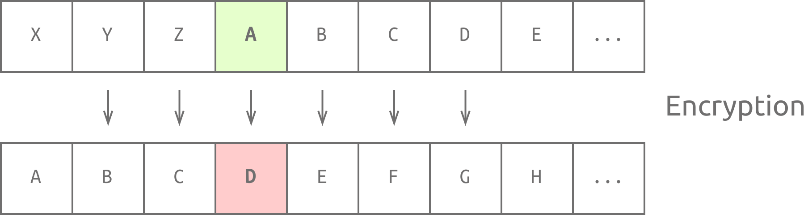
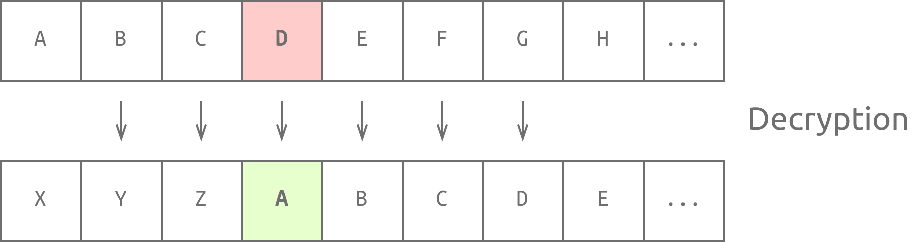
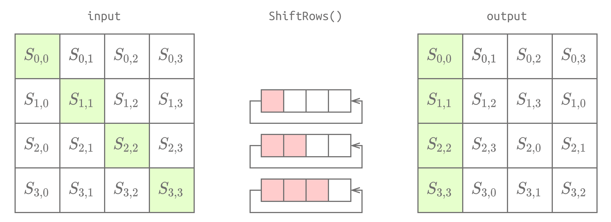

Notes: 
1. add in my-metarials
2. adding quipqiup to cheatsheet


# Cryptography

## Caesar Cipher
**Encryption**
- shifting by 3 to the right to encrypt


**Decrypquipqiupr the original message.




## CaeserCipher BruteForcer
```python
def caesar_cipher_decrypt(text, shift):
    decrypted_text = ""
    for char in text:
        if char.isalpha():  # Check if the character is an alphabet
            shift_base = 65 if char.isupper() else 97
            decrypted_char = chr((ord(char) - shift - shift_base) % 26 + shift_base)
            decrypted_text += decrypted_char
        else:
            decrypted_text += char  # Non-alphabetic characters are unchanged
    return decrypted_text

def brute_force_caesar_decrypt(ciphertext):
    for shift in range(1, 26):  # Try all shifts from 1 to 25
        decrypted_text = caesar_cipher_decrypt(ciphertext, shift)
        print(f"Shift {shift}: {decrypted_text}")

if __name__ == "__main__":
    # Take input from the user
    ciphertext = input("Enter the ciphertext to decrypt: ")
    print("Brute-force Decryption Results:")
    brute_force_caesar_decrypt(ciphertext)

```

## Transposition Cipher
- For this there will be a cipher and a clue
- We will use [quipqiup!](https://www.quipqiup.com/)

## AES( Advanced Encryption Standard )
#### 1. SubBytes
This transformation looks up each byte in a given substitution table (S-box) and substitutes it with the respective value. The state is 16 bytes, i.e., 128 bits, saved in a 4 by 4 array.

#### 2. ShiftRows
The second row is shifted by one place, the third row is shifted by two places, and the fourth row is shifted by three places. This is shown in the figure below.

#### 3. MixColumns
Each column is multiplied by a fixed matrix (4 by 4 array).

#### 4. AddRoundKey
A round key is added to the state using the XOR operation.




# GnuPG (GPG) Encryption and Decryption

## Encrypting a File
To encrypt a file (e.g., `message.txt`):
```bash
gpg --symmetric --cipher-algo CIPHER message.txt
```
- **Description**: Encrypts the file using a password and the specified algorithm (CIPHER). The output is saved as `message.txt.gpg`.

### ASCII Armored Output
To create an ASCII text version of the encrypted file:
```bash
gpg --armor --symmetric --cipher-algo CIPHER message.txt
```

### Check Supported Ciphers
To see available encryption algorithms:
```bash
gpg --version
```

## Decrypting a File
To decrypt the encrypted file (`message.txt.gpg`):
```bash
gpg --output original_message.txt --decrypt message.txt.gpg
```
- **Description**: Decrypts the file and saves the original content in `original_message.txt`. You will need to enter the encryption password.

Here's a concise and simple description of the OpenSSL commands and context:


# OpenSSL Encryption and Decryption

The OpenSSL Project provides tools for secure file encryption.

#### Encrypting a File
To encrypt a file (e.g., `message.txt`):
```bash
openssl aes-256-cbc -e -in message.txt -out encrypted_message
```

#### Decrypting a File
To decrypt the encrypted file (`encrypted_message`):
```bash
openssl aes-256-cbc -d -in encrypted_message -out original_message.txt
```

#### Enhanced Security
For stronger encryption:
- Use PBKDF2 and set the number of iterations:
```bash
openssl aes-256-cbc -pbkdf2 -iter 10000 -e -in message.txt -out encrypted_message
```
- Decrypt with the same options:
```bash
openssl aes-256-cbc -pbkdf2 -iter 10000 -d -in encrypted_message -out original_message.txt
```

#### Task Context
You will use GPG and OpenSSL on the AttackBox for symmetric encryption tasks. Files needed are located at `/root/Rooms/cryptographyintro/task02`.

