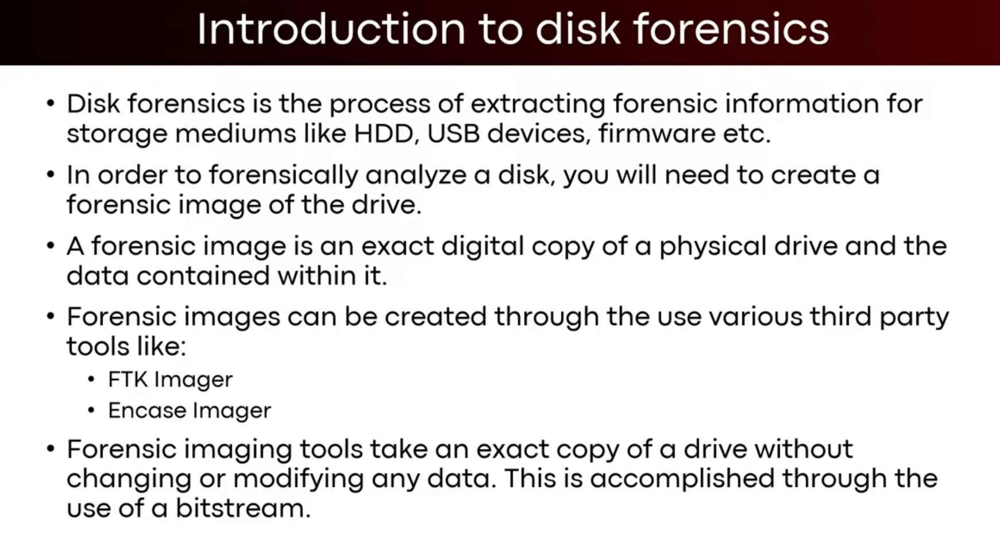
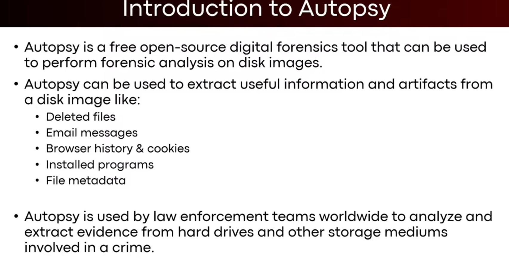
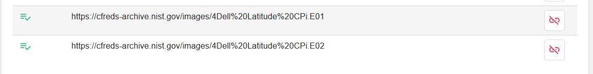

 




- We will use the data of NIST[This Scenario](https://cfreds.nist.gov/all/NIST/HackingCase)
- For Image Creation we will use FTK Imager
- And for forensics we will use Autopsy

we are going to use :



# Important commands
**For partitions**
```sh
mmls diskimage
```
**for getting into partition**
```sh
fls -o 0001140736  diskimage
```
**for getting into files with number**
```sh
fls -o 0001140736 diskImage 204
```

**For finding files with extension**
```sh
icat -o 0001140736  diskImage 8 |xxd |grep ".txt" -A3
```
