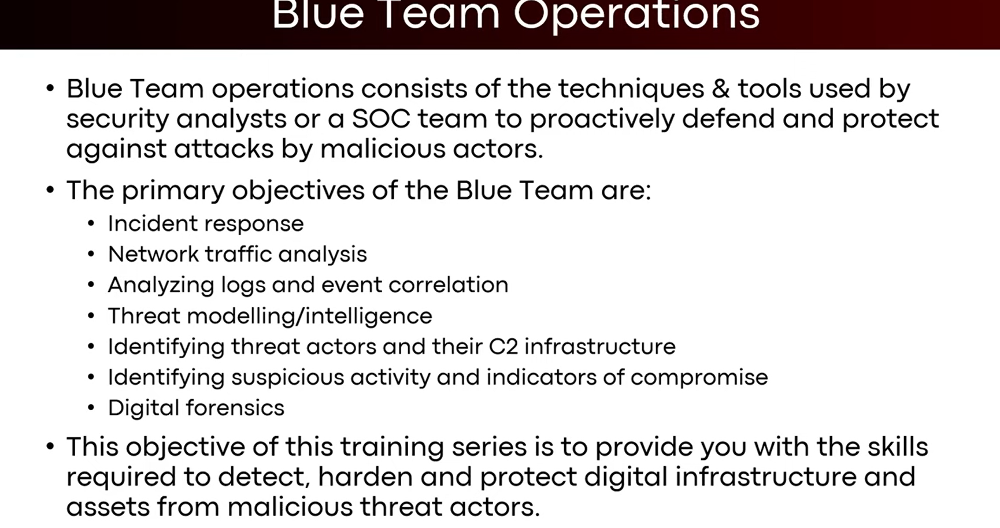
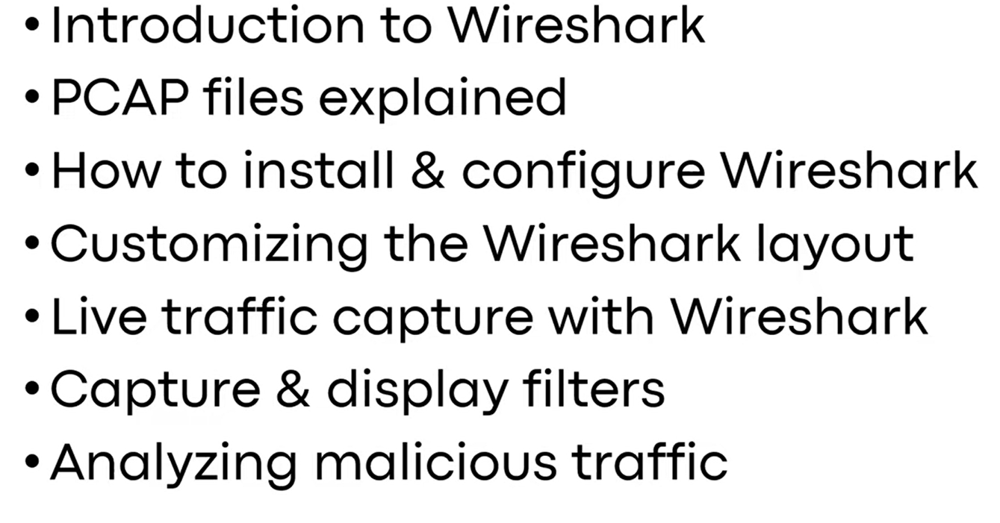
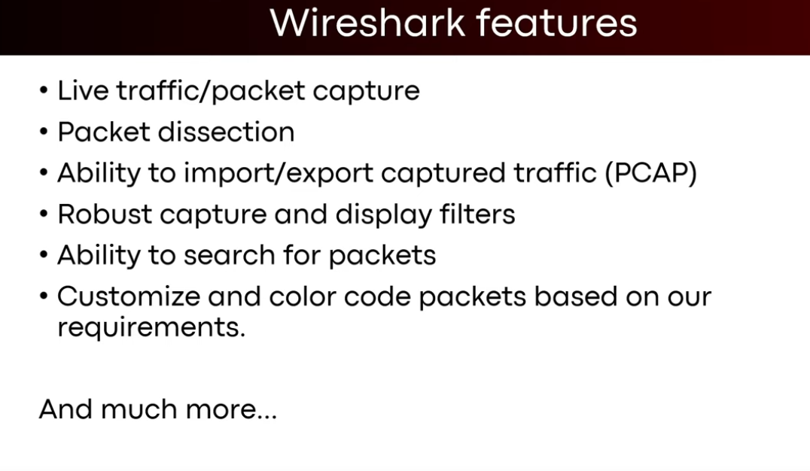
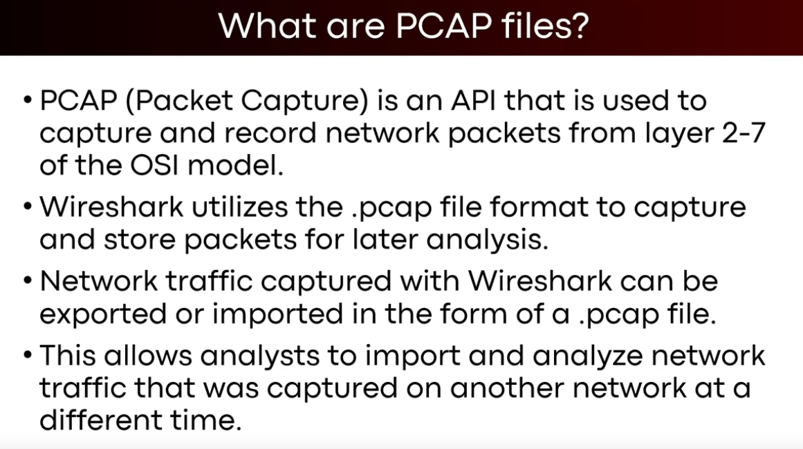
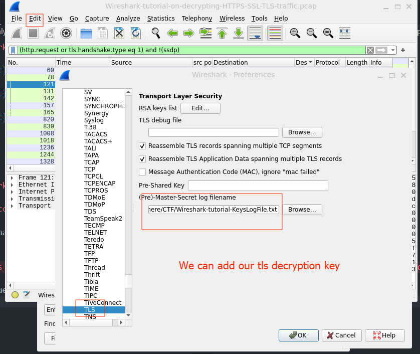

# Wireshark







 


# Wireshark Filters
----
## For successful Handshake 
```pcap
tls.handshake.type eq 1
```

## This is for all http req and tls handshake but we are avoiding ssdp
```pcap
(http.request or tls.handshake.type eq 1) and !(ssdp)
```

